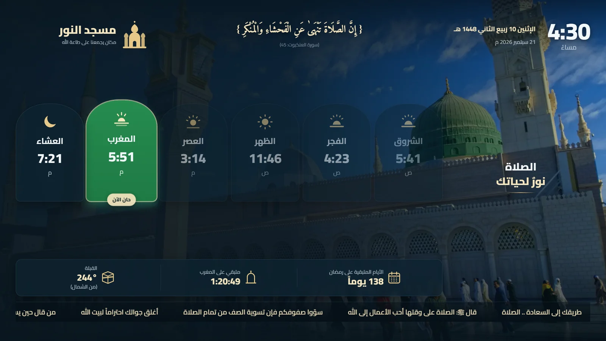
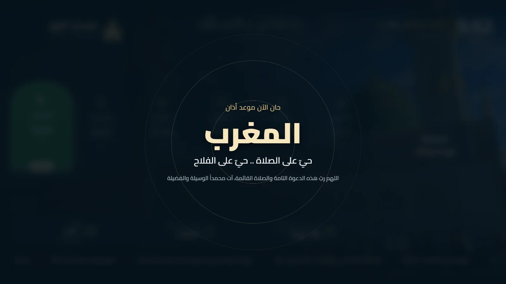
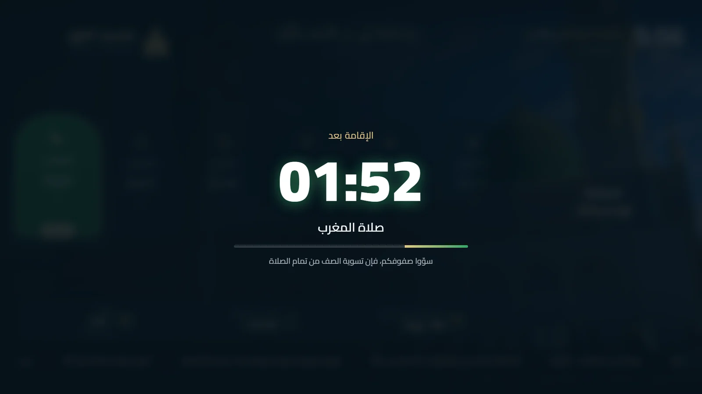
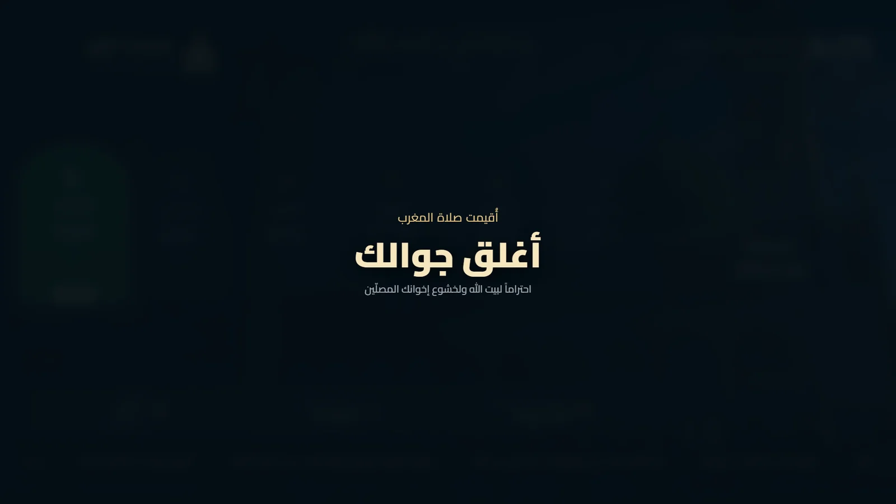
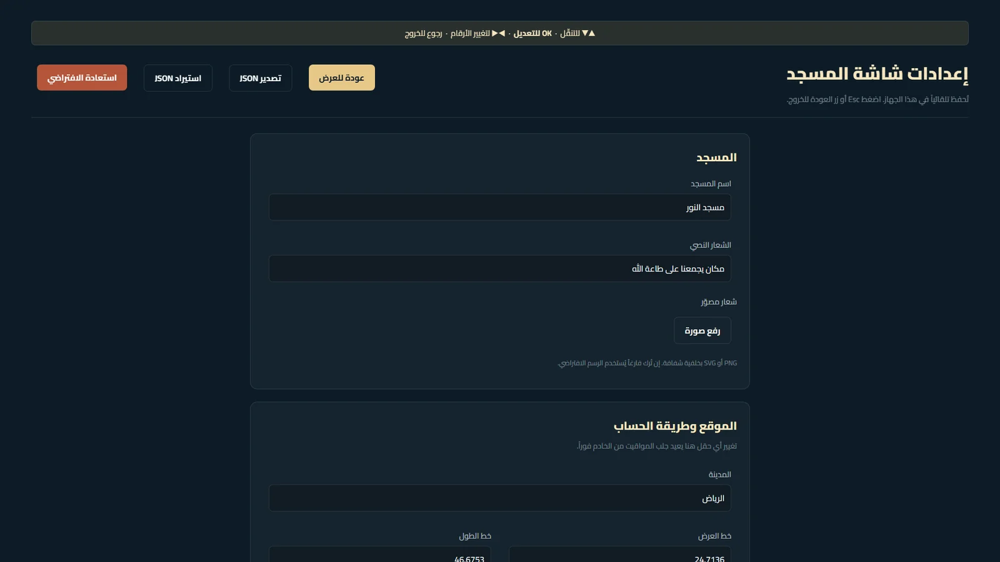
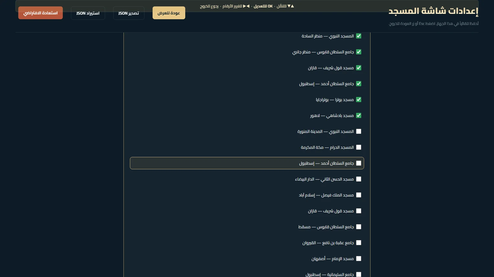

<div align="right">

# 🕌 شاشة مواقيت الصلاة

### واجهة عربية متحركة تعمل ٢٤/٧ على شاشة المسجد — بلا إنترنت، وبلا تدخّل

[](https://mohamedabdelguom1.github.io/mosque-prayer-display/)
[](https://github.com/Mohamedabdelguom1/mosque-prayer-display/actions)


</div>



<div align="right">

> شاشة معلّقة على جدار المسجد، تُقلع وحدها بعد انقطاع الكهرباء، وتواصل عرض
> المواقيت الصحيحة حتى لو غاب الإنترنت أسبوعاً. تُضبط كلها **من ريموت التلفاز**.

---

## ✨ ما الذي يميّزها

<table dir="rtl">
<tr>
<td width="50%" valign="top">

### 🔌 تصمد أمام الواقع

- **تعمل بلا إنترنت تماماً** — عامل خدمة يخزّن كل شيء داخل الجهاز
- **تُقلع وحدها** بعد انقطاع الكهرباء
- تقويم **شهر كامل** محفوظ محلياً
- إعادة محاولة بتراجع أسّي عند انقطاع الشبكة

</td>
<td width="50%" valign="top">

### 📺 مصمّمة لريموت التلفاز

- **خمس ضغطات OK** تفتح الإعدادات
- **▲▼** للتنقّل، **OK** للتعديل، **◀▶** لضبط الأرقام
- لا لوحة مفاتيح على الشاشة إطلاقاً
- كل شيء يُضبط وأنت جالس في مكانك

</td>
</tr>
<tr>
<td width="50%" valign="top">

### 🪶 خفيفة على عتاد ضعيف

- **٣٫٣ ميغابايت** ذاكرة مقيسة على عصا بـ٢ جيجا رام
- كل الحركات CSS على `transform` و`opacity` فقط
- مؤقّت واحد في التطبيق كله
- حماية من حرق الشاشة (Burn-in)

</td>
<td width="50%" valign="top">

### 🕌 عربية أصيلة

- خطوط **محلية** بلا أي CDN
- تاريخ هجري وميلادي
- أرقام هندية اختيارية
- **١٨ خلفية** لمساجد حقيقية

</td>
</tr>
</table>

---

## 🎬 الشاشات التلقائية

تتبدّل الشاشة وحدها حسب الوقت — بلا أي تدخّل.

<table dir="rtl">
<tr>
<td width="50%"><b>🔔 عند دخول الوقت — شاشة الأذان</b></td>
<td width="50%"><b>⏳ بعدها — العدّ التنازلي للإقامة</b></td>
</tr>
<tr>
<td></td>
<td></td>
</tr>
<tr>
<td width="50%"><b>🤫 أثناء الصلاة — أغلق جوالك</b></td>
<td width="50%"><b>⚙️ لوحة الإعدادات — بالريموت</b></td>
</tr>
<tr>
<td></td>
<td></td>
</tr>
</table>

---

## 🖼️ مكتبة الخلفيات

**١٨ صورة فوتوغرافية** لمساجد حقيقية — الحرمان الشريفان، والسلطان أحمد، والحسن
الثاني، وقول شريف، وجامع القيروان، والسليمانية، ومسجد الإمام بأصفهان، وغيرها.
كلها بتراخيص حرة من ويكيميديا كومنز.

**تختارها بمربّعات من الريموت — لا كتابة مسارات:**



---

## 🚀 التشغيل السريع

```bash
npm install
npm run dev          # http://localhost:5173
```

للإنتاج:

```bash
npm run build
npx serve dist -l 8080
```

للفحص الكامل:

```bash
npm run check        # الأنواع ثم ESLint ثم 118 اختباراً
```

---

## 🧱 كيف بُنيت

| الطبقة | الاختيار | لماذا |
|---|---|---|
| الواجهة | **React 19** + **TypeScript** | أنواع صارمة تمنع أخطاء المواقيت الصامتة |
| البناء | **Vite 7** | بناء سريع، وأصول مبصومة بتجزئة |
| المواقيت | **Aladhan API** | طلب واحد يعطي الشهر كاملاً مع التاريخ الهجري |
| التخزين | `localStorage` + **Service Worker** | لا خادم ولا قاعدة بيانات إطلاقاً |
| الاختبار | **Vitest** — ١١٨ اختباراً | المنطق دوال خالصة تُختبر بلا متصفح |
| النشر | **GitHub Actions** → Pages | دفعة واحدة تفحص وتنشر |

**المنطق مفصول عن React بالكامل:** `lib/schedule.ts` و`lib/phase.ts` و`lib/qibla.ts`
دوال خالصة، و`hooks/` مجرد أغلفة تحفظ نتائجها — ولهذا أمكن اختبارها بلا متصفح ولا DOM.

<details dir="rtl">
<summary><b>تفصيل تغطية الاختبارات (١١٨ اختباراً)</b></summary>

| الملف | ما يغطّيه |
|---|---|
| `schedule.test.ts` | بناء المواعيد، الإقامة، تعديل الدقائق، الانتقال لمواقيت الغد بعد العشاء |
| `phase.test.ts` | تسلسل الأذان والإقامة والصمت، وتصحيح الحالة بعد انقطاع |
| `format.test.ts` | ص/م، منتصف الليل والظهيرة، الأرقام الهندية، مفتاح اليوم المحلي |
| `qibla.test.ts` | اتجاه القبلة من أربع مدن، بقيم محسوبة باستقلال عن التنفيذ |
| `aladhan.test.ts` | تحليل الرد، الكاش، أخطاء الشبكة، تنظيف الأشهر القديمة |
| `storage.test.ts` | دمج الإعدادات، ترحيل النسخ القديمة، امتلاء حصة التخزين |
| `burnIn.test.ts` | دورة الإزاحة وحدودها، وتنظيف المؤقّت عند الإيقاف |
| `remoteGesture.test.ts` | خمس ضغطات OK لفتح الإعدادات، ومهلة التسلسل |
| `spatialNav.test.ts` | التنقّل بين الصفوف بالأسهم، وحدود القائمة |
| `remoteEdit.test.ts` | دخول وضع التحرير بـ OK والخروج بالرجوع، وضبط الأرقام |

كما قيس استهلاك الذاكرة فعلياً: ٣٢ دقيقة بتناوب مسرَّع (نحو ١٣٠ تبديل خلفية
و٣٩٠ تبديل آية) — الكومة بقيت حول ٣٫٣ ميغابايت بلا نموّ، وعدد عقد DOM ثابت.

</details>

---

## أول إعداد

1. افتح لوحة الإعدادات: **خمس ضغطات على OK** في الريموت،
   أو **Ctrl + Shift + S** على لوحة مفاتيح، أو أضف `#/settings` للرابط.
2. اضبط **اسم المسجد**، ثم **الإحداثيات وطريقة الحساب** لمدينتك.
3. اضبط **فروقات الإقامة** لكل صلاة، وعدّل المواقيت بالدقائق إن أردت مطابقة التقويم المحلي المعتمد.
   الافتراضي الآن **الرياض** بطريقة أم القرى.
4. اضغط **تصدير JSON** للاحتفاظ بنسخة، فتستطيع استيرادها لاحقاً أو نقلها لمسجد آخر.

الإعدادات تُحفظ في `localStorage` الخاص بالجهاز، فلا حاجة لخادم ولا قاعدة بيانات.

### الصوت

`public/audio/adhan.mp3` موجود بالفعل (تسجيل بترخيص CC BY-SA 4.0، تفاصيله في
`public/audio/README.txt`). استبدله بتسجيل مسجدك متى شئت.

أذان الفجر يختلف بزيادة «الصلاة خير من النوم». ضع له ملفاً باسم `adhan-fajr.mp3`
في المجلد نفسه؛ وإن لم يوجد **يرجع الفجر تلقائياً إلى `adhan.mp3`** بدل أن يدخل بلا صوت.
وإن حُذف الملفان معاً تعمل الشاشة كاملة بلا صوت وبلا أي رسالة خطأ.

المتصفحات تمنع التشغيل التلقائي قبل أول ضغطة؛ في وضع Kiosk نمرّر
`--autoplay-policy=no-user-gesture-required` فيختفي القيد تماماً.

### الخلفيات

**مكتبة من 18 صورة** لمساجد حقيقية — الحرمان الشريفان، والسلطان أحمد، والحسن الثاني،
وقول شريف، والقيروان، والسليمانية، وأصفهان، وغيرها. كلها صور فوتوغرافية بتراخيص حرة
من ويكيميديا كومنز، مقصوصة على 1920×1080، ونسبتها لأصحابها في [public/bg/library.json](public/bg/library.json).

**الاختيار من لوحة الإعدادات:** قسم «مكتبة الخلفيات» يعرض القائمة بمربّعات اختيار،
تؤشّر ما تريده بزر **OK** من الريموت. لا حاجة لكتابة مسارات.

المؤشَّر افتراضياً ستّ صور تتناوب بتلاشٍ متبادل مدته ثانيتان، كل 90 ثانية.
صورة واحدة تعني مشهداً ثابتاً بلا تناوب.

**لإضافة صورك:** ضعها في `public/bg` ثم اكتب مسارها في حقل «خلفيات إضافية من عندك»
هكذا `./bg/name.webp`، مسار في كل سطر.

> **الإقلاع الأول لا يثقل:** الصور الستّ الافتراضية فقط تُخزَّن مسبقاً (نحو 4 م.ب).
> وبقية المكتبة (3.8 م.ب) تُجلب عند أول عرض لها ثم تبقى محفوظة بلا إنترنت.
> وإن تعذّر تحميل صورة، يتخطّاها المشهد إلى التالية بدل أن يومض فارغاً.

يُفضّل صور عرضية 1920×1080 يقع فيها المبنى في الثلث الأيمن،
لأن الجهة اليسرى تُظلَّل بقوة لتستقبل البطاقات والنصوص.

## التركيب على Xiaomi TV Stick (أو أي Android TV)

الجهاز المستهدف: عصا شاومي 4K — 2 جيجا رام، معالج Cortex-A55، أندرويد TV 11.
الواجهة مصمَّمة لهذا الحجم من العتاد: كل الحركات CSS على `transform`
و`opacity` فقط، والذاكرة المقيسة حول 3.3 ميغابايت.

### ١. متصفح يفتح تلقائياً

**Fully Kiosk Browser** من متجر Play — ونسخته المجانية تكفي تماماً.

> **مهم:** لا تُفعّل خيار **Kiosk Mode**. هو الميزة المدفوعة الوحيدة التي
> نحتاج تجنّبها، وتفعيله في النسخة المجانية يضع **علامة مائية على الشاشة**.
> وظيفته منع الخروج بأزرار Home وBack — وشاشة معلّقة لا يلمسها أحد لا
> تحتاج هذا القفل. أما ما نحتاجه فعلاً فمجاني بالكامل:
>
> | ما نحتاجه | مجاني؟ |
> |---|---|
> | Launch on Boot | ✅ |
> | Fullscreen Mode | ✅ |
> | Keep Screen On | ✅ |
> | تشغيل الوسائط تلقائياً | ✅ |
> | Kiosk Mode (قفل الأزرار) | ❌ مدفوع — **ولا نحتاجه** |

#### بدائل مفتوحة المصدر بالكامل

إن أردتَ ألّا تعتمد على تطبيق مغلق المصدر أصلاً:

| البديل | ملاحظة |
|---|---|
| [Webview Kiosk](https://f-droid.org/en/packages/uk.nktnet.webviewkiosk/) | على F-Droid، مفتوح المصدر، تثبيته موثوق وسهل |
| [Firestick Kiosk Browser](https://github.com/RyAndroid330/firestick-kiosk-browser) | مصمَّم لعصا تلفاز: ملء شاشة، تشغيل عند الإقلاع، وإعدادات بالريموت |
| [TV Bro](https://github.com/truefedex/tv-bro) + [Launch-On-Boot](https://github.com/ITVlab/Launch-On-Boot) | متصفح تلفاز مفتوح المصدر، مع تطبيق صغير يشغّله عند الإقلاع |
| [FreeKiosk](https://github.com/RushB-fr/freekiosk) | رخصة MIT، لكنه موجّه للأجهزة اللوحية أكثر من التلفاز |

هذه كلها تحتاج **تثبيتاً جانبياً** (sideload) عبر تطبيق Downloader بعد
تفعيل «مصادر غير معروفة»، وهو أطول من التثبيت من المتجر.

### ٢. إعداد Fully Kiosk

1. **Start URL** → الرابط أعلاه.
2. فعّل **Fullscreen Mode**، وأطفئ **Show Action Bar** و**Show Address Bar**.
3. فعّل **Launch on Boot** — هذا ما يعيد الشاشة بعد انقطاع الكهرباء.
4. فعّل **Keep Screen On** حتى لا ينام العرض.
5. في قسم الوسائط فعّل تشغيل الصوت تلقائياً، فيختفي طلب الضغط لتفعيل الأذان.
6. **اترك Kiosk Mode مطفأً.**

### ٣. التشغيل الأول

اترك الصفحة تُحمَّل كاملة مرة واحدة والعصا متصلة بالإنترنت. عندها:

- يخزّن عامل الخدمة كل ملفات الواجهة (٢٠ ملفاً، ٤ ميغابايت) داخل العصا.
- يُحفظ تقويم الشهر كاملاً في ذاكرة المتصفح.

بعد ذلك تُقلع الشاشة وتعمل **بلا إنترنت إطلاقاً**، وتحدّث نفسها تلقائياً
كلما عاد الاتصال.

### ٤. الضبط من الريموت

لا يوجد في ريموت التلفاز `Ctrl` ولا حروف، فاستُبدل اختصار لوحة المفاتيح:

| ما تريده | ما تضغطه |
|---|---|
| فتح لوحة الإعدادات | **زر OK خمس مرات متتالية** خلال ثلاث ثوانٍ |
| التنقل بين الحقول | **▲ ▼** — الصف المركَّز عليه يُحاط بإطار ذهبي |
| تعديل حقل كتابة | **OK** للدخول، ثم **رجوع** للخروج منه |
| تغيير رقم (فروقات الإقامة والتعديلات) | **◀ ▶** مباشرة، بلا لوحة مفاتيح |
| قلب خيار (نعم/لا) | **OK** |
| الخروج من اللوحة | زر **الرجوع** |

> **لماذا لا تُفعَّل الحقول إلا بـ OK:** على Android TV يفتح النظام لوحة
> المفاتيح بمجرد وصول البؤرة إلى حقل نص، فتبتلع هي كل مفاتيح الاتجاه
> ويعلق المشرف داخل الحقل. لذلك البؤرة تقع على **الصف** لا على الحقل،
> ولا يُفتح الحقل للكتابة إلا حين تضغط OK صراحةً.

خمس ضغطات سريعة لا تقع مصادفة على شاشة معلّقة لا يلمسها أحد.

> **ملاحظة:** الإعدادات تُحفظ داخل العصا نفسها لا على الخادم، فاضبطها
> عليها مباشرة. ولنسخها لمسجد آخر استخدم **تصدير JSON** من اللوحة.

### تحديث الشاشة لاحقاً

ادفع أي تعديل إلى فرع `main` على GitHub؛ يفحصه سير العمل (أنواع + تدقيق
+ ١١٨ اختباراً) وينشره تلقائياً. العصا تلتقط النسخة الجديدة عند أول إقلاع
متصل بالإنترنت.

## التركيب على جهاز لينكس (بديل)

إن استخدمت Raspberry Pi بدل العصا، في `scripts/` خدمتا systemd جاهزتان:

```bash
npm run build
sudo cp scripts/mosque-display*.service /etc/systemd/system/
sudo systemctl enable --now mosque-display-server
sudo systemctl enable --now mosque-display
```

`serve.sh` يخدم `dist` على المنفذ 8080، و`kiosk.sh` ينتظر الخادم ثم يشغّل
Chromium بوضع Kiosk مع تعطيل إطفاء الشاشة.


## مصدر المواقيت

تُجلب من [Aladhan API](https://aladhan.com/prayer-times-api) — طلب واحد يعطي **الشهر كاملاً**
مع التاريخ الهجري لكل يوم. التقويم يُحفظ في `localStorage`:

- تُعرض المواقيت من الذاكرة فوراً عند الإقلاع، بلا شاشة تحميل.
- التحديث يجري في الخلفية، والشهر التالي يُجلب مسبقاً قبل نهاية الشهر بخمسة أيام.
- عند انقطاع الشبكة تُعاد المحاولة بتراجع أسّي (1، 2، 5، 15 دقيقة)، والشاشة تواصل العمل من الجدول المحفوظ.
- إن تجاوز عمر آخر تحديث ناجح ثلاثة أيام يظهر مؤشر صغير في الزاوية.

اتجاه القبلة يُحسب محلياً بمعادلة الدائرة العظمى، فلا يحتاج أي طلب شبكة.

## وضع الاختبار

أضف `?mock=HH:MM` للرابط لإزاحة ساعة التطبيق إلى وقت محدد، فيستمر الوقت
في التقدّم من هناك. مفيد لاختبار التسلسل كاملاً بلا انتظار:

| الرابط | ما يُختبر |
|---|---|
| `?mock=12:13:50` | لحظة دخول الظهر وانتقال التمييز وظهور شاشة الأذان |
| `?mock=12:20` | العدّ التنازلي للإقامة |
| `?mock=12:32` | شاشة «أغلق جوالك» |
| `?mock=22:30` | ما بعد العشاء: اللوحة تنتقل إلى مواقيت الغد |

## ملاحظات على البنية

- **مؤقّت واحد** في التطبيق كله (`useClock`) يوزّع الوقت على كل المكوّنات.
- **كل الحركات بـ CSS** على `transform` و `opacity` فقط — لا مكتبة تحريك، حفاظاً على 60fps على جهاز ضعيف.
- **آلة الحالات** (`usePhase`) تحسب الطبقة المعروضة من الوقت الحالي مقارنة بالجدول،
  لا من مؤقّتات متتابعة، فتصحّح نفسها تلقائياً لو نام الجهاز أو أُعيد تحميل الصفحة.
- **حماية من حرق الشاشة:** إزاحة الجذر بضعة بكسلات كل أربع دقائق بحركة بطيئة غير ملحوظة.
- **الخطوط محلية** في `public/fonts` — لا اعتماد على أي CDN.
- **عامل خدمة** يخزّن كل أصول الواجهة مسبقاً، فتُقلع الشاشة بلا إنترنت.
  قائمة الملفات تُحقن عند البناء من `vite.config.ts` لا يدوياً، لأن أسماء
  الأصول مبصومة بتجزئة تتغيّر مع كل بناء.
- **المنطق مفصول عن React:** `lib/schedule.ts` و `lib/phase.ts` دوال خالصة،
  و`hooks/` مجرد أغلفة تحفظ نتائجها — ولهذا أمكن اختبارها بلا متصفح ولا DOM.


---

<div align="center">

**صُنعت لتعمل في مسجد حقيقي، لا لتُعرض في مقابلة عمل.**

[🖥️ شاهد الشاشة](https://mohamedabdelguom1.github.io/mosque-prayer-display/) &nbsp;·&nbsp;
[📸 الصور](docs/shots) &nbsp;·&nbsp;
[🖼️ مصادر الخلفيات](public/bg/BACKGROUNDS.md)

</div>
